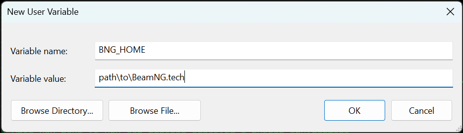

# MATLAB and Simulink Support for BeamNG.tech

MATLAB and Simulink Support for BeamNG.tech allows to connect the Mathworks
products with the BeamNG.tech software with two different methods:

* MATLAB ↔ BeamNGpy ↔ BeamNG.tech
* Simulink ↔ BeamNG.tech

Both the bridges can be use independently from each other and have
different scopes. However, they can be really handy when used together as
in this [example](simulink_demos).

## MATLAB bridge setup

### Install BeamNG.tech

The first step to used the MATLAB bridge is to have a working version of
[BeamNG.tech](https://beamng.tech/). As an optional point you can create an
evironment variable `BNG_HOME` pointing to the folder containing the
BeamNG.tech executable. 
This allows you to omit this path when creating an instance of the BeamNGpy class. 
To create a new environment variable go to _Edit system environment
variables/Environment Variables.../New..._. You should now see the
following window, where you have to insert `BNG_HOME` in the _Variable name_ 
field and the path of the folder containing the BeamNG.tech executable in
the _Variable value_ field, then press _OK_.



### Setup python environment

Once you have BeamNG.tech installed you can proceed creating a python environment. 
Be careful to use a
[python version compatible with your MATLAB version](https://nl.mathworks.com/support/requirements/python-compatibility.html). Having a python
environment ready, you can proceed installing BeamNGpy on it, when doing
so keep in mind to comply with the
[compatibility table
between BeamNGpy and BeamNG.tech](https://github.com/BeamNG/BeamNGpy#compatibility).

### Connect MATLAB to python

The last step that you need to perform is to connect MATLAB to your new
python environment. 
This can be easily done using the `setup_beamngpy` function. 
For example, if you have a conda python environment you just need to call
this function from the command window with a similar input:

```matlab
setup_beamngpy('C:\Users\<username>\miniconda3\envs\<env-name>\python.exe')
```

Now you are ready to use BeamNGpy through MATLAB, to see some examples on
how to use it look at the [MATLAB examples](matlab.md).
For more information about BeamNGpy refer to its [documentation](https://beamngpy.readthedocs.io/en/latest/).

## Simulink bridge setup

### Install BeamNG.tech

In order to use the Simulink bridge the only thing that you need to have
other than Simulink is a working version of [BeamNG.tech](https://beamng.tech/).

For more information regarding the Simulink interface refer to the
corresponding section in the documentation.
