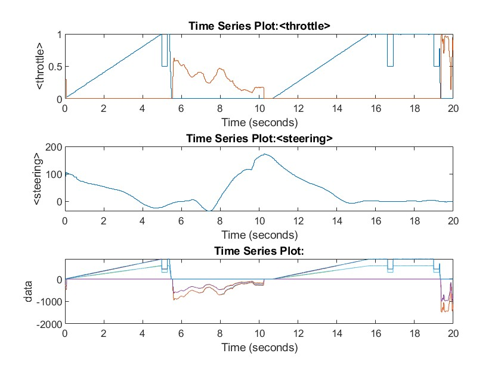

# Combined Example

The example script `combined_demo.mlx` together with the Simulink model `combined_model.slx` uses both MATLAB Bridge and the Simulink Bridge for co-simulation in a combined way. BeamNG is started and set up via MATLAB commands and co-simulation coupling is handled by the Simulink model.

To open the example, copy the examples folder to your current working directory, by running the following in the MATLAB command window:

```
beamng.copy_examples
```

Both files are directly located in the `examples` folder.

You can open the script `combined_demo.mlx` and run it. The output should look similar to the following figure.


