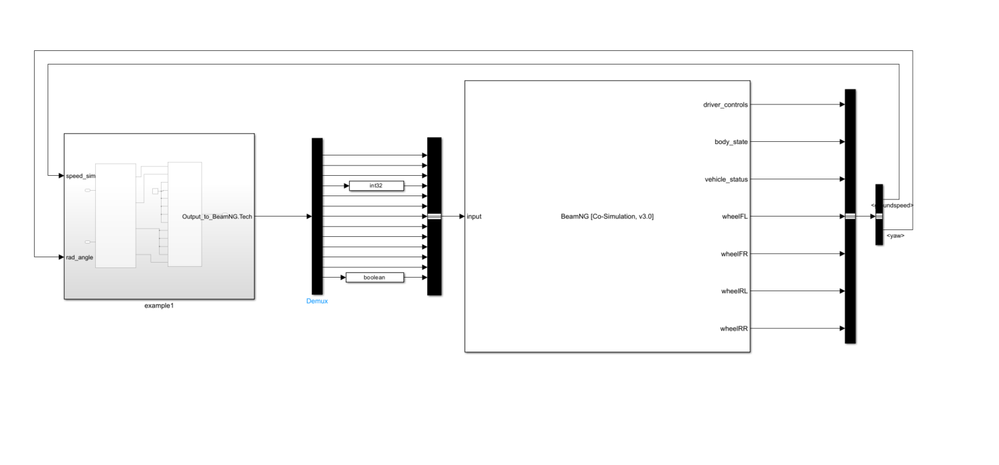
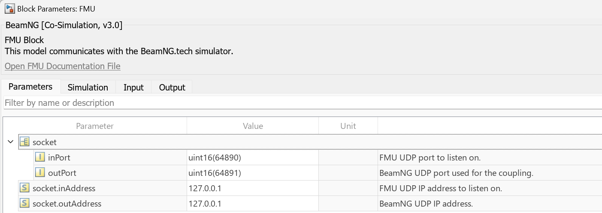

# Simulink FMU Examples

These steps guide you through using FMU (Functional Mock-up Unit) integration with Simulink for co-simulation with BeamNG.tech, supporting both FMI 2 and FMI 3 standards. To make your custom FMU model, follow the [BeamNG FMU](https://github.com/BeamNG/BeamNG-FMU) repository. 

Copy the examples folder to your current working directory, by running the following in the MATLAB command window:

```
beamng_copy_examples
```

1. **Open an Example Model:**
   Begin by opening one of the example models, *FMI2.slx* or *FMI3.slx*, available in the `examples/simulink/FMI` folder.

   
    Figure 1: The FMU-Simulink model

2. **Configure the FMU Block:**
   Double-click the red FMU block within the model to configure it. Specify the path to your chosen BeamNG-FMU file. After configuration, the block should display the "BeamNG" text, indicating proper linkage.

3. **Edit FMU Parameters:**
   To modify the FMU parameters such as input/output ports and simulation time, double-click the FMU file. 

   
    Figure 2: The FMU-Simulink model parameters

4. **Start the Vehicle Coupling:**
   Follow the [integration instructions](introduction.md#231-run-beamng-fmi-in-simulink) similar to those for the S-function Simulink integration to start the vehicle coupling. Alternatively, use the `Ctrl+Shift+V` shortcut to initiate coupling directly in BeamNG. Once started, the vehicle will begin moving, and you should observe a simulation environment similar to the following:

   
    Figure 3: The FMU-Simulink model running
