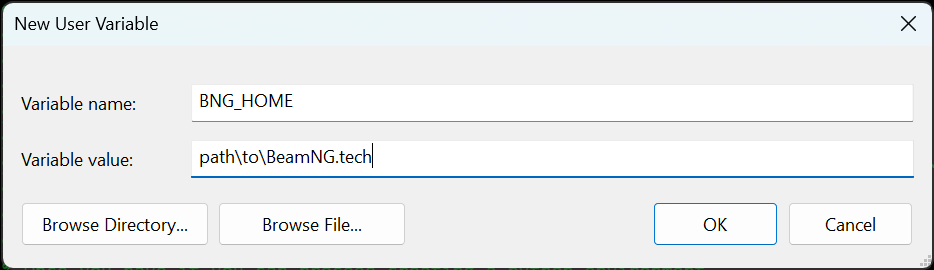
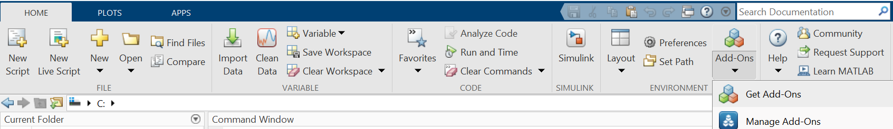
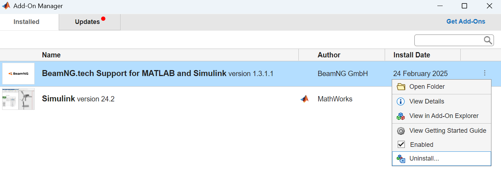

# Installation

To make MATLAB and Simulink work with BeamNG.tech, you have to install and configure several software components first:
* MATLAB and optionally Simulink
* Python and the BeamNGpy package
* BeamNG.tech
* *BeamNG.tech Support for MATLAB and Simulink* (this toolbox)

The following sections describe the installation process in detail.

```{note}
Before continuing, check [Compatibility](compatibility.md) to make sure you install compatible versions.
```

## Install BeamNG.tech

The first step is to install [BeamNG.tech](https://beamng.tech/). Check the website how to
acquire a license, and follow the provided instructions to download and install the software.

It is also recommended to create an environment variable `BNG_HOME` pointing to the folder containing the
BeamNG.tech executable. With this your scripts become simpler and more portable, because you don't need to
hardcode this path in you scripts. To create a new environment variable on **Windows**, perform the following steps:
1. Click **Start** and enter *environment*
2. Click on **Edit environment variables for your account** (or if you have administrator privileges, you can also choose **Edit the system environment variables** and then **Environment Variables...**)
3. Click **New...** and enter the following information:
   
   

   The variable value is the path to the **folder** where the file **BeamNG.drive.exe** is located.
4. Click OK

## Install and set up Python

Once you have BeamNG.tech installed you can proceed installing [Python](https://www.python.org/). 
Install a
[Python version compatible with your MATLAB version](https://nl.mathworks.com/support/requirements/python-compatibility.html). During installation, make sure you check **Add Python to PATH**, so that it is recognized as an available program.

```{tip}
If you forgot to tick the adding to PATH option during installation, you can either re-run the Python installer and check it this time, or you can add the following two entries to your in `PATH` environment variable (see how to set environment variables above): `path\to\python` and `path\to\python\Scripts`.
```

## Install BeamNGpy

Having a Python environment ready, you can proceed installing [BeamNGpy](https://github.com/BeamNG/BeamNGpy) on it, when doing
so keep in mind to comply with the
[compatibility table
between BeamNGpy and BeamNG.tech](https://github.com/BeamNG/BeamNGpy#compatibility).

You can install BeamNGpy using `pip`. Open a Command Prompt or Terminal and type the following to install the latest version of BeamNGpy.

```
pip install beamngpy
```

To install a different version (e.g. `1.30`), type

```
pip install beamngpy==1.30
```

## Install *BeamNG.tech Support for MATLAB and Simulink*

The simplest way is to install the latest version via the MATLAB Add-On Manager ([Option 1](#option-1-install-latest-version-via-add-on-manager)). However, you can also manually install any version of the toolbox, including older versions ([Option 2](#option-2-manually-install-any-desired-version)).

### Option 1: Install latest version via Add-On Manager

Perform the following steps to install the toolbox:
1. Launch MATLAB
2. In the **Home** tab, under **Add-Ons** select **Get Add-Ons**

   

3. The **Add-On Explorer** will open. Search for *BeamNG* and select **BeamNG.tech Support for MATLAB and Simulink**

   

4. Click on the **Add** button to install and accept the license agreement

After successful installation you can open the **Getting Started Guide** which will bring you back to this documentation you are currently reading.

### Option 2: Manually install any desired version

To manually download and install a specific version, perform the following steps:

1. Open the [Releases](https://github.com/BeamNG/BeamNG-MATLAB-Simulink-integration/releases) page of the GitHub repository
2. Scroll to the desired version and download the `.mltbx` file under **Assets**
3. In MATLAB go to the directory where the file was downloaded and double-click on the `.mltbx` file
4. The toolbox version will be installed


## Connect MATLAB to Python

The last step that you need to perform is to connect MATLAB to your new
Python environment. This can be easily done using the `setup_beamngpy` function.

* To use your current default Python environment, just run:

  ```matlab
  setup_beamngpy
  ```

* Advanced users, who have multiple Python versions or virtual environments installed, can define the Python environment they want to use with by specifying the path to the Python executable, similar to this example:

  ```matlab
  setup_beamngpy('C:\Users\<username>\miniconda3\envs\<env-name>\python.exe')
  ```

If no errors occur and you see the text `BeamNGpy detected`, you are now ready to use BeamNG through MATLAB. If you have Simulink installed, you can also use the Simulink co-simulation functionalities now.

## Uninstall

If you want to uninstall *BeamNG.tech Support for MATLAB and Simulink* from your Add-ons in MATLAB, perform the following steps.

1. Launch MATLAB
2. In the **Home** tab, under **Add-Ons** select **Manage Add-Ons**

   

3. In the line **BeamNG.tech Support for MATLAB and Simulink**, click on the 3 dots on the right and select **Uninstall**

   

4. The toolbox will be uninstalled

To uninstall the other software components (BeamNGpy, Python, BeamNG.tech, MATLAB) follow the uninstall guides in the corresponding documentation of each component.
