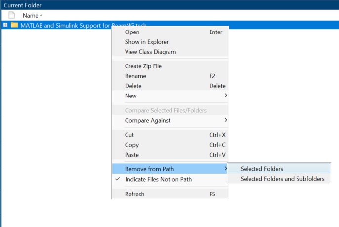
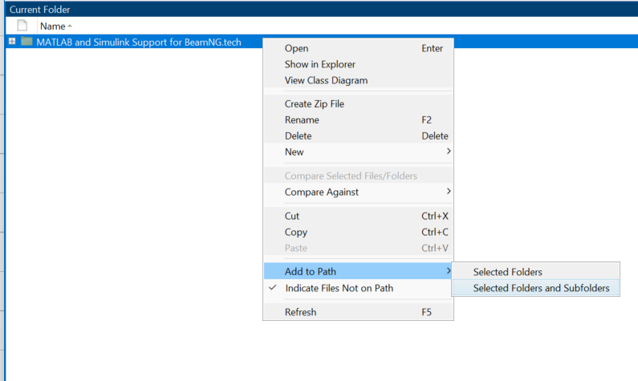
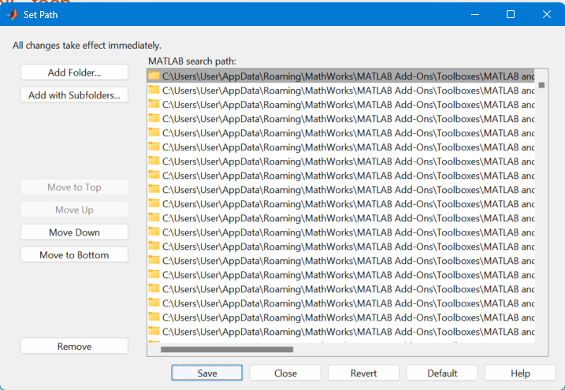

# Introduction

**BeamNG.tech Support for MATLAB and Simulink** is a MATLAB toolbox that allows you to connect [MathWorks](https://www.mathworks.com/) products with [BeamNG.tech](https://beamng.tech/). It comes with two components:

**MATLAB Bridge** allows you to control BeamNG from MATLAB scripts, for example to set up scenarios or to query vehicle information. This uses [BeamNGpy](https://github.com/BeamNG/BeamNGpy) and MATLAB's [ability to call Python libraries](https://www.mathworks.com/products/matlab/matlab-and-python.html) in the background.

```{mermaid}
graph LR;
  ml(MATLAB)<-->py(BeamNGpy)<-->bng(BeamNG.tech);
```

**Simulink Bridge** allows you to set up a co-simulation between a Simulink model and a BeamNG vehicle. It comes with 2 options:

* S-function block: Uses Simulink's s-function mechanism to communicate to BeamNG via the UDP protocol.

  ```{mermaid}
  graph LR;
    sl(Simulink)<-->sf(S-function)<-->|UDP|bng(BeamNG.tech);
  ```

* FMU block according to the [FMI Standard](https://fmi-standard.org/): Uses Simulink's FMU block with an exported FMU by BeamNG to communicate to BeamNG via the UDP protocol. Both FMI 2.0 and FMI 3.0 versions are available.

  ```{mermaid}
  graph LR;
    sl(Simulink)<-->fmu(FMU)<-->|UDP|bng(BeamNG.tech);
  ```

The **MATLAB Bridge** and the **Simulink Bridge** can be used independently from each other and have different scopes. However, they can be also used together, see [Combined Example](combined.md).


## 2. Simulink bridge

## 2.1 Setting up Simulink

Just follow [this link](https://www.mathworks.com/matlabcentral/fileexchange/166246-beamng-tech-support-for-matlab-and-simulink), and install the toolbox from the MathWorks file exchange.  
<a name="S-function_introduction"></a>


## 2.2 BeamNG.tech integration with Simulink S-function

The [Co-Simulation Editor](https://documentation.beamng.com/beamng_tech/cosimulationeditor/introduction/) allows the BeamNG.tech user to set up a tightly-coupled system between a BeamNG vehicle and third-party software (such as Mathworks Simulink). A GUI-based tool facilitates the creation of .csv files which are used as a contract to describe the parameters of the message-passing between the two sides of the coupling. The user can use the mouse to choose from a multitude of properties across the vehicle (kinematic properties, wheel data, vehicle electrics data, powertrain data, etc) - properties which are to be sent to the third party. Incoming properties (from the third party) are also selected in a similar way.

<a name="S-function_instructions"></a>

### 2.2.1 Instructions
To establish a tight-coupling communication with Simulink through S-function, follow the following steps:

1. Start the BeamNG.tech simulation in your favorite map.
2. Click ```F11``` to access the ```World Editor ```.
3. Click on the [Co-Simulation Editor](https://documentation.beamng.com/beamng_tech/cosimulationeditor/introduction/).

    

    Figure 1: The ```Co-Simulation Editor``` window

4. If you have a your coupling-configuration csv file in your user-folder (it is located in ```%USERPROFILE%\AppData\Local\BeamNG.tech\0.3x``` by default), you have to reload the csv by clicking on ```Start/stop coupling with 3rd party``` button, then another ```File dialog window``` will appear to load your csv.

    

    Figure 2: The File dialog window to load your csv.

5. If you want to create your signals file, click on ```Open the available signal for this vehicle``` button, it will open another window where you can select your signals ```From``` and ```To``` for sending and receiving signals.

    

    Figure 3: The ```available signal list``` window.

6. Save your csv by click on ```save the current signals configuration, for this vehicle, to disk``` button.

    

    Figure 4: The File dialog window to save your configuration as csv file.

7. Click on ```Start/stop coupling with 3rd party``` button at your Co-Simulation Editor window to start the coupling.
8. Open your Simulink model, add your S-function.
9. double-click on your S-function, and type the path of your csv file.
10. Load your csv signals file to your S-function.

    

    Figure 5: Loading csv file window in S-function.

11. Set the Simulation time in Simulink in model settings use ```Fixedstep``` type and calculate your ```Fixed-step size``` to match the simulation time in BeamNG, using the following formula:

    ```ceil(SimulinkDt / physicsDt) * physicsDt ```

    where ```SimulinkDt``` is the Simulink computation time, ```physicsDt``` is the BeamNG physics step time (fixed at 0.0005 seconds), and ceil is the ceiling operator. Figure below shows where this is set (highlighted in yellow).

    

    Figure 6: The Configuration Parameters window of Simulink model.

12. Run your S-function model in Simulink.
13. To stop coupling, stop coupling at BeamNG.tech end by pressing on the same button that started the coupling i.e., ```Start/stop coupling with 3ed party``` , or click on **CTRL+R** to reload the vehicle, then press on ```Stop``` Simulink end.


<a name="S-function_examples"></a>

### 2.2.2 Examples
We have some examples [here](sfunction.md) that shows basic controller that have S-function connected with BeamNG.tech.


<a name="S-function_disclaimer"></a>

### 2.2.3 Disclaimer
It's recommended open only one instance of S-function, having more than one instance of S-function might disturb the coupling.


<a name="fmu_start"></a>

## 2.3 BeamNG.tech integration with Simulink FMI
A BeamNG FMI for the [Functional Mock-up Interface](https://fmi-standard.org/) allows the BeamNG.tech user to set up a [tightly-coupled](https://documentation.beamng.com/beamng_tech/cosimulationeditor/tight_coupling/) system between a BeamNG vehicle and third-party software (such as Mathworks Simulink). The ```vehicleSystemsCoupling``` lua controller will facilitates the communication and signal selection.


## 2.3.1 Run BeamNG FMI in Simulink

The Lua controller must be loaded in order to start the tight coupling. We can do this with the following three steps:

1. Launch the BeamNG.drive simulator and navigate to the main menu.
2. Select the "Freeroam" option to enter the free-roaming mode.
3. Choose your preferred map from the available options.
4. Access the Lua console debug window by pressing the backtick (`) key or the tilde (~) key.
5. The vehicle should then be selected at the bottom-left of this screen (usually this will be “BeamNG - Current Vehicle”).
6. The following command should be typed into the command bar, to load the controller: ```controller.loadControllerExternal('tech/vehicleSystemsCoupling', 'vehicleSystemsCoupling', {})```, or you can use the shortcut for the specific controller i.e., **CTRL+V**
7. Open your Simulink and add your FMI block.
8. Configure your FMI model by using this format at your Command Window in MATLAB ```fmudialog.createBusType('<YOUR_MODEL>/<FMI_BLOCK>')```. This command should list your inputs and outputs.
9. Run your FMI model.
10. To stop coupling, stop coupling at BeamNG.tech end by pressing on **CTRL+V** to stop the coupling or **CTRL+R** to reload the vehicle, then Simulink end.

Figure 7 shows the bar at the bottom of the console window in detail. Note the vehicle selection menu on the left, and the command bar on the right, where one can enter commands.

The Simulink process should also be started. If BeamNG is not running, Simulink will block its execution until it receives a message from BeamNG. The reverse is also true; if Simulink is not executing, BeamNG will block execution.

When communication has been established over the UDP send and receive sockets (after both ends of the communication have started executing), the tight coupling process will commence.


Figure 7: The Console Window Command Bar


<a name="fmu_examples"></a>

### 2.3.2 Examples
you can see some examples [here](fmi.md#examples-with-fmu-in-simulink) with Simulink examples, and Simulink only example. To make your custom FMU model, follow the [BeamNG FMU](https://github.com/BeamNG/BeamNG-FMU) repository.


## 4. Troubleshooting
<a name="troubleshooting"></a>

This section lists common issues with [BeamNG-MATLAB-Simulink generic interface](https://documentation.beamng.com/beamng_tech/matlab_and_simulink/) in particular. Since this
library is closely tied to BeamNG.tech, it is also recommended to consult the [support in documentation website](https://documentation.beamng.com/support/troubleshooter/#bng-adventure:/start/techstart) on BeamNG.tech


If you can not see the toolbox in your Simulink library Browser, you may have to add the toolbox path to MATLAB search path, please do the following steps:

1- open your MATLAB and navigate to your toolbox folder i.e., ```%USERPROFILE%\AppData\Roaming\MathWorks\MATLAB Add-Ons\Toolboxes```

2- from ```current folder``` window, right-click on the toolbox folder, and click on ```Remove from path```, select ```Selected Folders``` as shown below



Figure 8: Remove toolbox folder from path

3-Then, right click on the folder and from ```add path```, select ```Selected Folders and Subfolders``` as shown below

  

Figure 9: Add toolbox folder and Subfolders to path

3-Lastly you have to save this changes in ```MATLAB search path```, look for ```Set Path``` option and click ```Save```

   

Figure 10: Save the changes in ```Set Path```


<a name="Contributions"></a>

## 5. Contributions


We always welcome user contributions, be sure to check out our [contribution guidelines](contributing.rst) first, before starting your work.


<a name="license"></a>

## 6. License

Copyright &copy; 2024, BeamNG GmbH.
All rights reserved.
This project is licensed under the BSD 3-Clause License - see the [LICENSE](license.rst) file for details.

The [BeamNG FMU](fmi.md) is a fork of the [Reference FMUs](https://github.com/modelica/Reference-FMUs) by Modelica Association Project, which are a fork of the [Test FMUs](https://github.com/CATIA-Systems/Test-FMUs) by Dassault Syst&egrave;mes, which are a fork of the [FMU SDK](https://github.com/qtronic/fmusdk) by QTronic, all of which are released under the 2-Clause BSD License.
