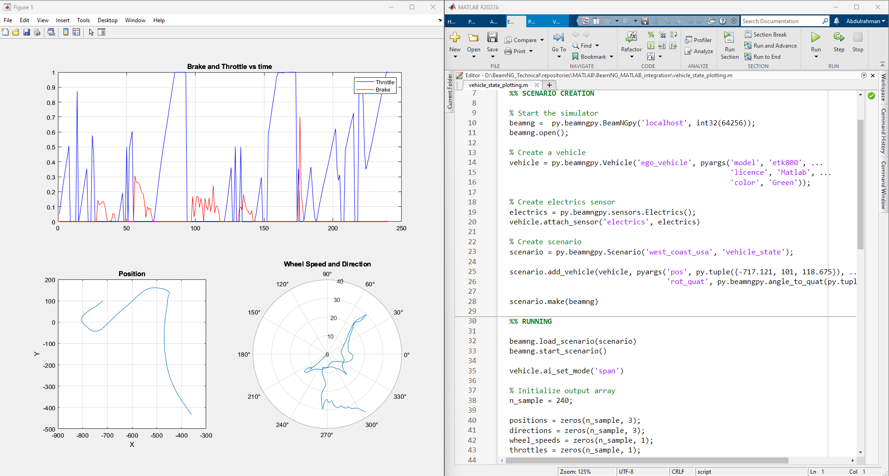
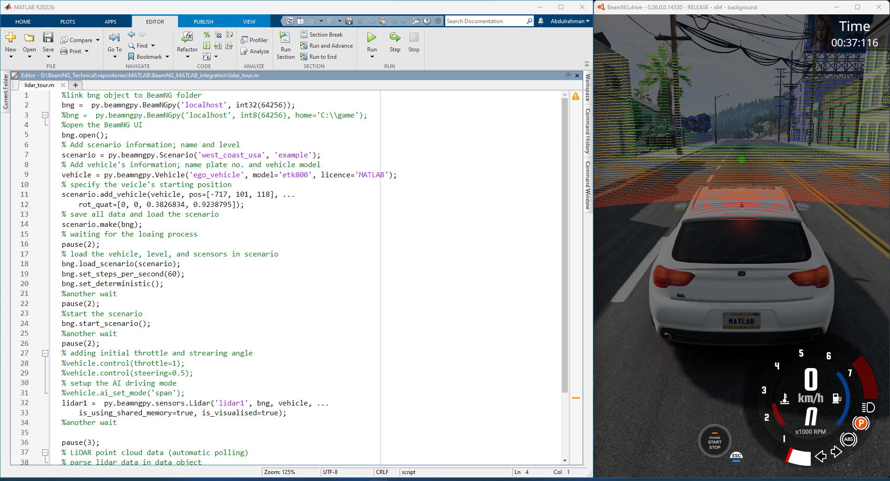
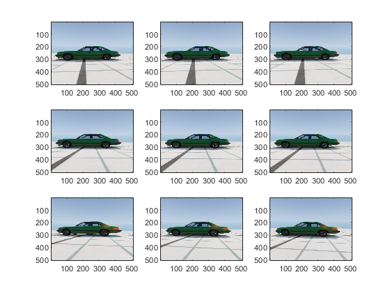
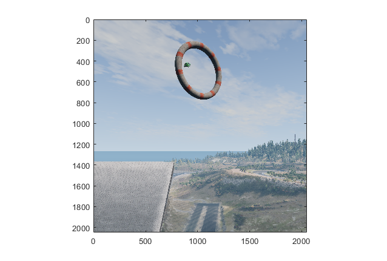
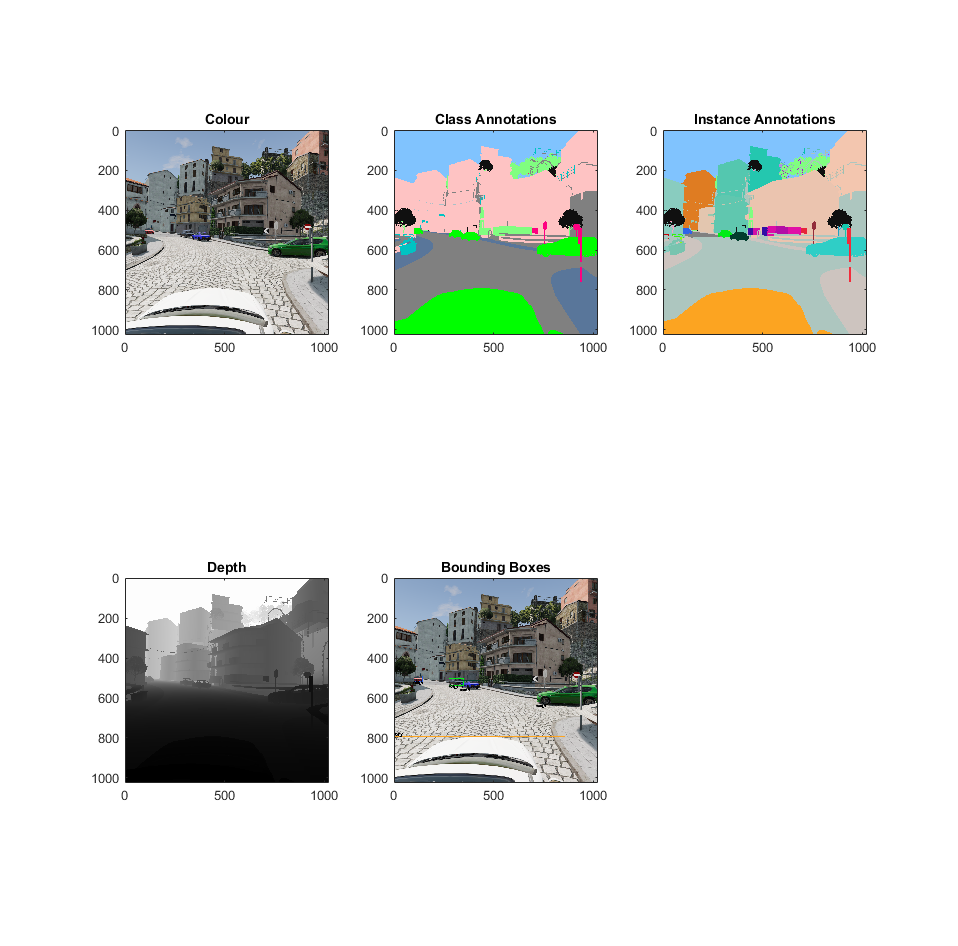

# MATLAB Bridge Examples

We provide 5 live scripts that showcase the versatility of using the MATLAB bridge to launch the BeamNG.tech simulator. These scripts demonstrate various capabilities such as utilizing sensors, creating scenarios, capturing screenshots from multiple viewpoints, analyzing movements, and visualizing sensors including lidar, depth camera, and AI driving for the vehicle.

To open the scripts, copy the examples folder to your current working directory, by running the following in the MATLAB command window:

```
beamng_copy_examples
```

The live scripts are located in `examples/matlab`. We recommend you to run all examples yourself *section by section* by clicking on the **Run Section** button in the MATLAB Toolstrip at the top of the Live Editor.

## Example 1: Vehicle State Plotting

In the script `vehicle_state_plotting.mlx` you use the state sensor to plot some graphs of the vehicle position, wheel speed and direction, throttle, and brake. 


    
## Example 2:  Lidar Tour

The script `lidar_tour.mlx` simulates a Lidar sensor and controls the vehicle using the simulator's AI control.



## Example 3:  Multi-shot Camera

In the script `multishot_camera.mlx` you change the position and rotation of a camera.



## Example 4:  Object Placement

The script `object_placement.mlx` defines a custom scenario for a given map and generates procedural content, i.e. simple meshes.



## Example 5:  Annotation and Bounding Boxes


In the script `annotation_bounding_boxes.mlx` you get semantic annotations, instance annotations, and draw bounding boxes.

```{note}
The bounding boxes feature is not ready for use yet.
```


