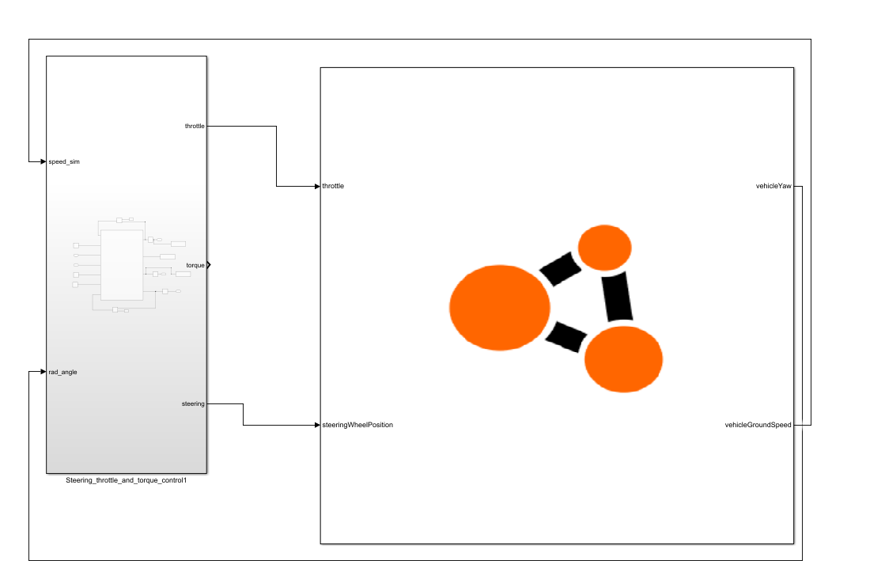

# Simulink Examples

We have provided some Simulink code examples to demonstrate the BeamNG-Simulink coupling in action. To execute these examples effectively, it is crucial to configure the three control parameters described in this document: window width, send wait, and send offset. The examples are available in the models named *throttle_example.slx* and *torques_example.slx*, detailed below:


    Figure 1: The M-function in the example model


Copy the examples folder to your current working directory, by running the following in the MATLAB command window:

```
beamng_copy_examples
```

Both examples are located in `examples/simulink/S-function`.

## Example 1: Pedal Control to Maintain Speed Limit

This example (*throttle_example.slx*) allows users to test a coupling example that maintains the vehicle's speed limit and orientation angle on the map. The block receives vehicle orientation information as input and controls the vehicle via throttle. The speed limit can be adjusted using the `speed_input` constant block, and the orientation angle with the `Desired_steering_angle_input` constant input to the M-function as illustrated in Figure 1.


    Figure 2: The example 1 model 

## Example 2: Wheel Torque to Control Speed Limit

This example (*torques_example.slx*) allows users to test another coupling scenario that maintains the vehicle's speed limit and orientation angle on the map. In this case, the block receives vehicle orientation information as input and controls the vehicle through torques applied to each wheel. Adjustments to the speed limit and orientation angle are made via the `speed_input` and `Desired_steering_angle_input` constant blocks, respectively, as shown in Figure 3.


    Figure 3: The example 2 model
