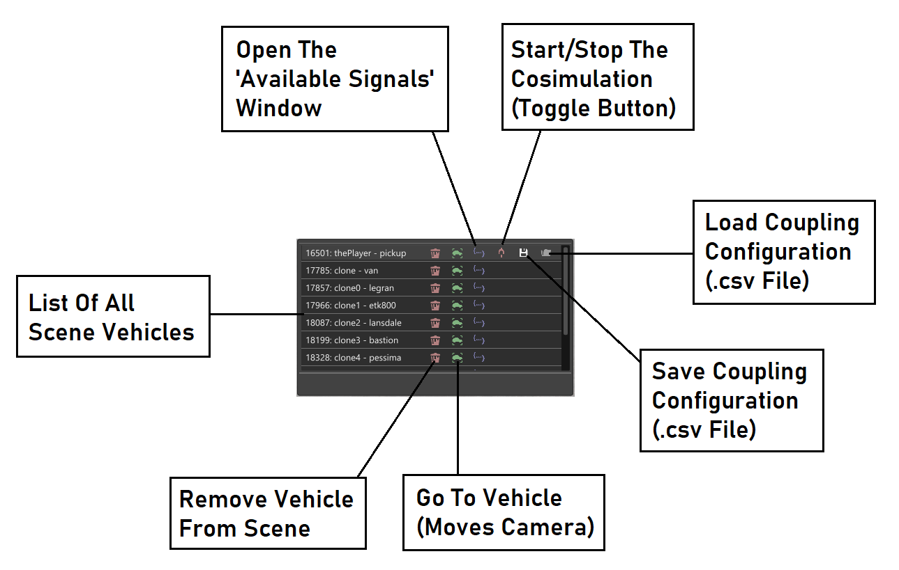
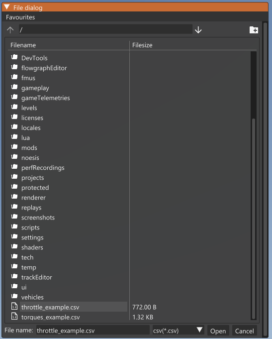
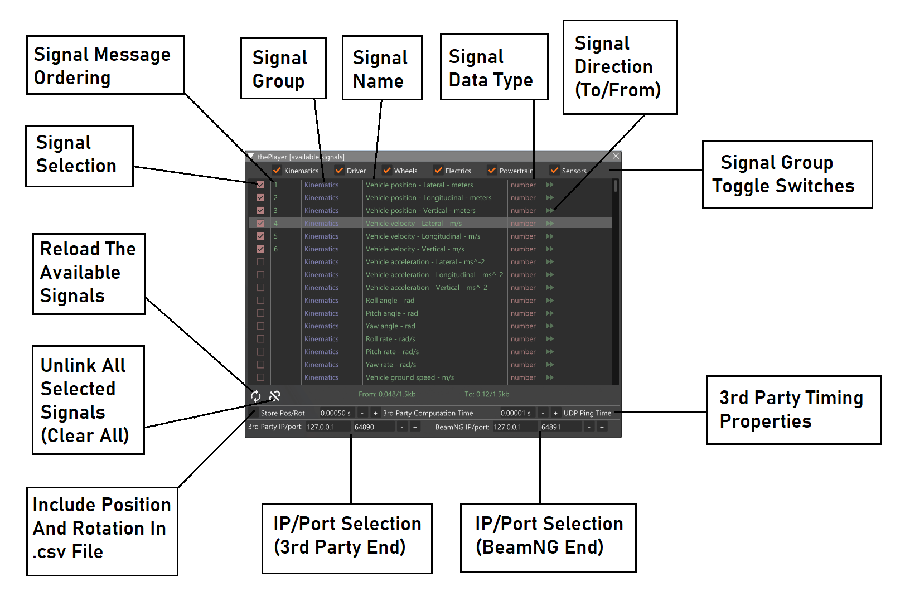
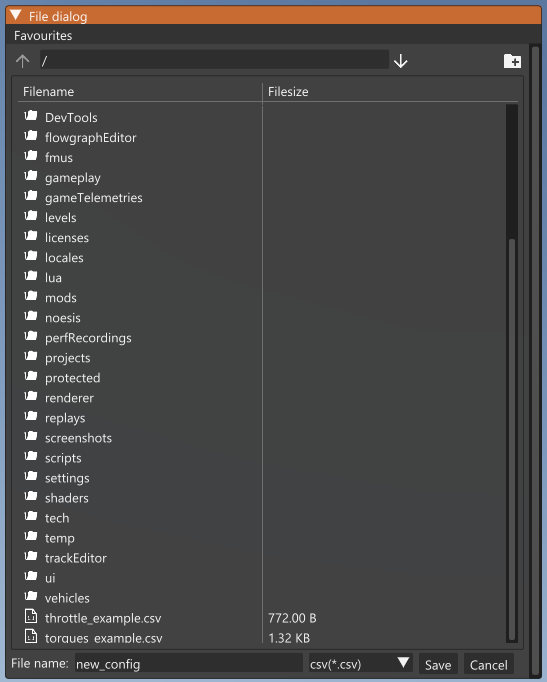
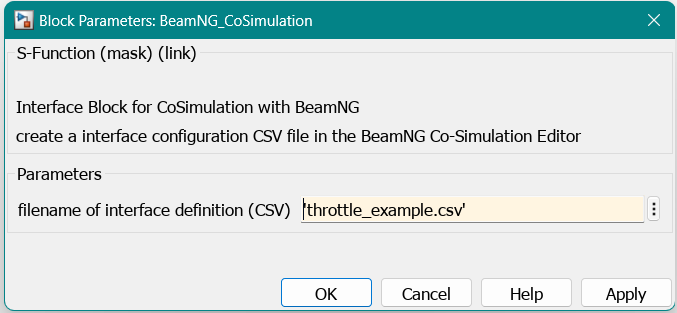
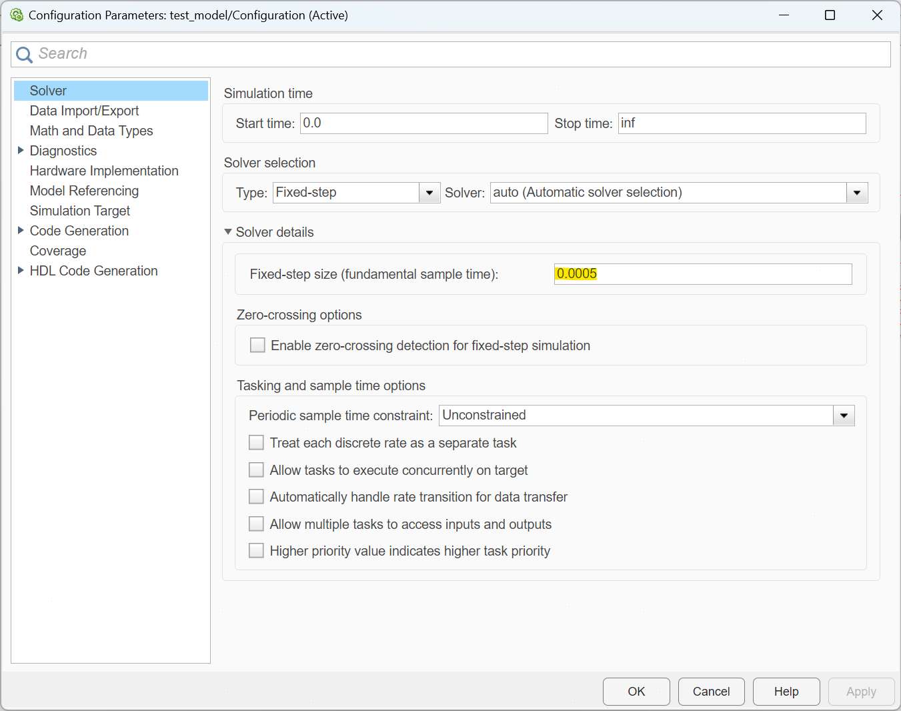

# Configure block interface

When you use the *S-function* block you can configure the inputs and outputs that are communicated to BeamNG using the **Co-Simulation Editor** in BeamNG.

```{note}
This feature is not yet available for the FMU blocks. Those blocks come with a fixed interface.
```

## Introduction

The [Co-Simulation Editor](https://documentation.beamng.com/beamng_tech/cosimulationeditor/introduction/) allows the BeamNG.tech user to set up a tightly-coupled system between a BeamNG vehicle and third-party software (such as Mathworks Simulink). A GUI-based tool facilitates the creation of .csv files which are used as a contract to describe the parameters of the message-passing between the two sides of the coupling. The user can use the mouse to choose from a multitude of properties across the vehicle (kinematic properties, wheel data, vehicle electrics data, powertrain data, etc) - properties which are to be sent to the third party. Incoming properties (from the third party) are also selected in a similar way.

### Instructions

To establish a tight-coupling communication with Simulink through S-function, follow the following steps:

1. Start the BeamNG.tech simulation in your favorite map.
2. Click ```F11``` to access the ```World Editor ```.
3. Click on the [Co-Simulation Editor](https://documentation.beamng.com/beamng_tech/cosimulationeditor/introduction/).

    

    Figure 1: The ```Co-Simulation Editor``` window

4. If you have a your coupling-configuration csv file in your user-folder (it is located in ```%USERPROFILE%\AppData\Local\BeamNG.tech\0.3x``` by default), you have to reload the csv by clicking on ```Start/stop coupling with 3rd party``` button, then another ```File dialog window``` will appear to load your csv.

    

    Figure 2: The File dialog window to load your csv.

5. If you want to create your signals file, click on ```Open the available signal for this vehicle``` button, it will open another window where you can select your signals ```From``` and ```To``` for sending and receiving signals.

    

    Figure 3: The ```available signal list``` window.

6. Save your csv by click on ```save the current signals configuration, for this vehicle, to disk``` button.

    

    Figure 4: The File dialog window to save your configuration as csv file.

7. Click on ```Start/stop coupling with 3rd party``` button at your Co-Simulation Editor window to start the coupling.
8. Open your Simulink model, add your S-function.
9. double-click on your S-function, and type the path of your csv file.
10. Load your csv signals file to your S-function.

    

    Figure 5: Loading csv file window in S-function.

11. Set the Simulation time in Simulink in model settings use ```Fixedstep``` type and calculate your ```Fixed-step size``` to match the simulation time in BeamNG, using the following formula:

    ```ceil(SimulinkDt / physicsDt) * physicsDt ```

    where ```SimulinkDt``` is the Simulink computation time, ```physicsDt``` is the BeamNG physics step time (fixed at 0.0005 seconds), and ceil is the ceiling operator. Figure below shows where this is set (highlighted in yellow).

    

    Figure 6: The Configuration Parameters window of Simulink model.

12. Run your S-function model in Simulink.
13. To stop coupling, stop coupling at BeamNG.tech end by pressing on the same button that started the coupling i.e., ```Start/stop coupling with 3ed party``` , or click on **CTRL+R** to reload the vehicle, then press on ```Stop``` Simulink end.

