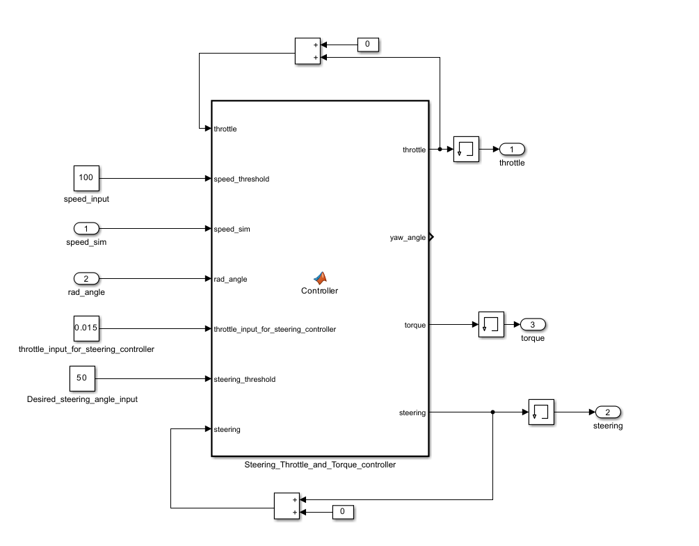
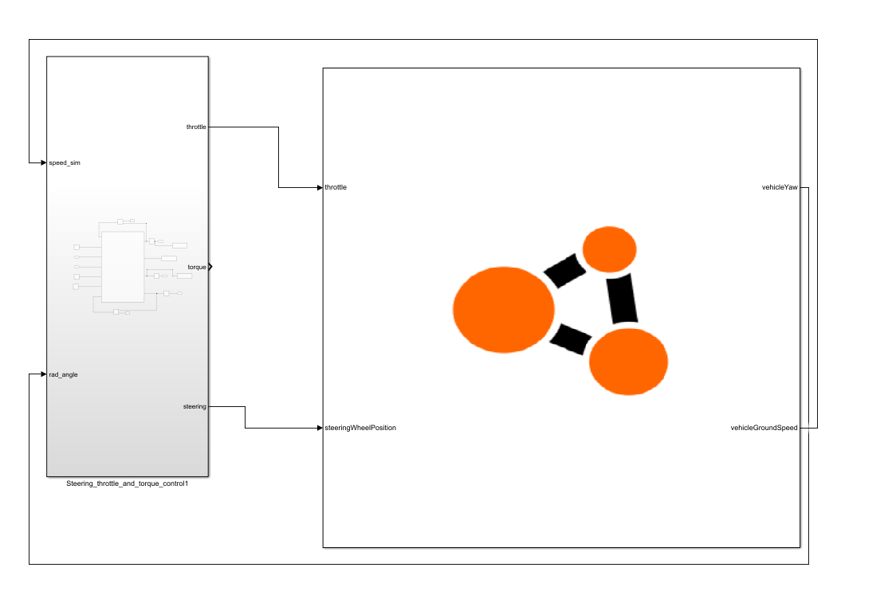
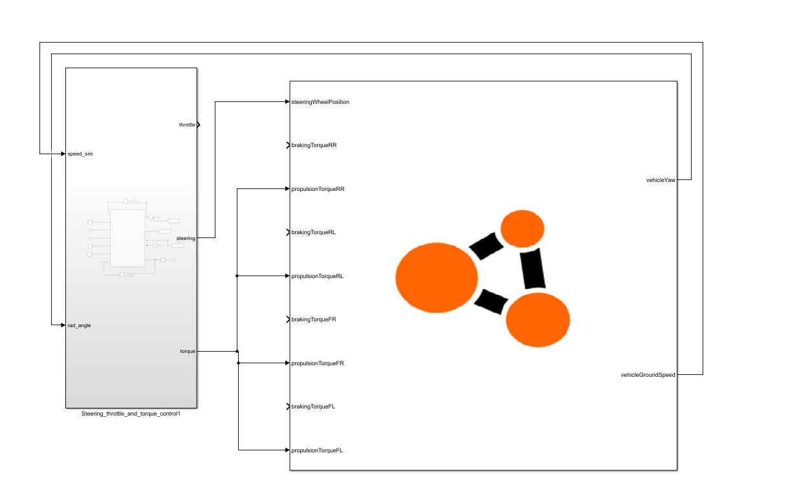

# S-function Examples

We provide Simulink examples to demonstrate the BeamNG-Simulink co-simulation in action. To execute these examples effectively, it is crucial to configure the three control parameters described in this document: window width, send wait, and send offset. The examples are available in the models named *throttle_example.slx* and *torques_example.slx*, detailed below:


    Figure 1: The controller used in both examples


Copy the examples folder to your current working directory, by running the following in the MATLAB command window:

```
beamng_copy_examples
```

Both examples are located in `examples/simulink/S-function`. Change your working directory to this folder.

## Example 1: Pedal Control to Maintain Speed Limit

The example *throttle_example.slx* maintains the vehicle's speed limit and orientation angle on the map. The block receives vehicle orientation information (yaw angle) and speed as input and controls the vehicle via throttle and steering angle. The speed limit can be adjusted using the `speed_input` constant block, and the orientation angle with the `Desired_steering_angle_input` constant block to the controller as shown in Figure 1.


    Figure 2: Throttle example

## Example 2: Wheel Torques to Maintain Speed Limit

The example *torques_example.slx* also maintains the vehicle's speed limit and orientation angle on the map. In this case, the vehicle is controlled through torques applied to each wheel. Adjustments to the speed limit and orientation angle are made in the same way as in the throttle example.



    Figure 3: Torques example

## How to run each example

To run one of above examples, follow these steps:

1. In MATLAB, change your working directory to `examples/simulink/S-function` (run `beamng_copy_examples` if you haven't done so yet)
2. Launch BeamNG.tech
3. Click on **Freeroam**
4. Select a map, e.g. **Grid, Small, Pure** and choose a spawn point, click **Spawn**
5. The default vehicle will be used, if you want to use another vehicle, press `Esc` and click on *Vehicles* or press `Ctrl+E` and choose the vehicle you like
   
   ```{note}
   The communication interface (csv file) is vehicle-specific, because not all signals are available for all vehicles. These examples, however, use only basic signals available for all vehicles that have a powertrain (but not other objects selectable in the vehicles menu such as a cone).
   ```
6. In the simulation, press `F11` to open the **World Editor**
7. Click on **Co-Simulation Editor** to open it
8. Copy both `.csv` files from your MATLAB working directory to `C:\Users\<User>\AppData\Local\BeamNG.drive\<Version>`, where `<User>` is your username and `<Version>` is the version of BeamNG you are using.
9. In the **Co-Simulation Editor**, select **CoSim** from the dropdown menu
10. Click **Start/stop coupling with 3rd party**, select the `.csv` file of the example you want to run (e.g. `throttle_example.csv` for the throttle example) and click **Open**
11. BeamNG will freeze and the window might be still open for a while. This is normal.
12. Open the Simulink model you want to run (e.g. `throttle_example.slx` for the throttle example) and click **Run**
13. The model is configured to run indefinitely, so you can stop it anytime by clicking **Stop**. This will stop the Simulink model, but BeamNG will still wait for the next Simulink step and looks frozen.
14. To stop BeamNG waiting for Simulink, click on **Start/stop coupling with 3rd party** again.
