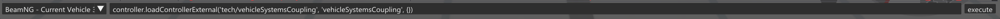

# FMU Blocks

BeamNG's FMU blocks according to the [FMI Standard](https://fmi-standard.org/) allows the BeamNG.tech user to set up a [tightly-coupled](https://documentation.beamng.com/beamng_tech/cosimulationeditor/tight_coupling/) system between a BeamNG vehicle and third-party software (such as Mathworks Simulink). We support FMI 2.0 and FMI 3.0.

The `vehicleSystemsCoupling` lua controller will facilitates the communication and signal selection.

## Set up the FMU co-simulation

The Lua controller must be loaded in order to start the tight coupling. We can do this with the following three steps:

1. Launch the BeamNG.drive simulator and navigate to the main menu.
2. Select the "Freeroam" option to enter the free-roaming mode.
3. Choose your preferred map from the available options.
4. Access the Lua console debug window by pressing the backtick (`) key or the tilde (~) key.
5. The vehicle should then be selected at the bottom-left of this screen (usually this will be “BeamNG - Current Vehicle”).
6. The following command should be typed into the command bar, to load the controller:
   ```
   controller.loadControllerExternal('tech/vehicleSystemsCoupling', 'vehicleSystemsCoupling', {})
   ```
   or you can use the shortcut for the specific controller i.e., **CTRL+V**
7. Open your Simulink and add your FMI block.
8. Configure your FMI model by using this format at your Command Window in MATLAB ```fmudialog.createBusType('<YOUR_MODEL>/<FMI_BLOCK>')```. This command should list your inputs and outputs.
9. Run your FMI model.
10. To stop coupling, stop coupling at BeamNG.tech end by pressing on **CTRL+V** to stop the coupling or **CTRL+R** to reload the vehicle, then Simulink end.

Figure 7 shows the bar at the bottom of the console window in detail. Note the vehicle selection menu on the left, and the command bar on the right, where one can enter commands.

The Simulink process should also be started. If BeamNG is not running, Simulink will block its execution until it receives a message from BeamNG. The reverse is also true; if Simulink is not executing, BeamNG will block execution.

When communication has been established over the UDP send and receive sockets (after both ends of the communication have started executing), the tight coupling process will commence.



Figure 7: The Console Window Command Bar
