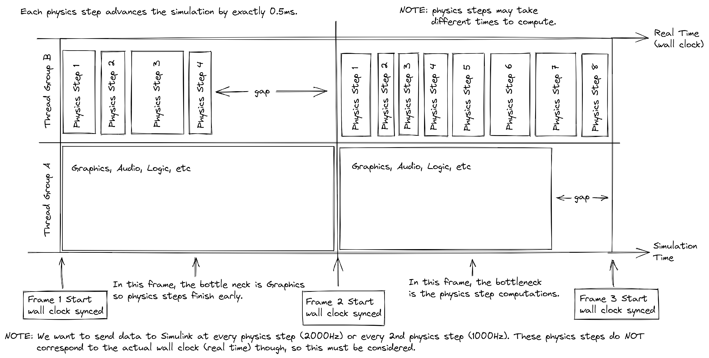

# Fundamental Concepts

[Tightly-coupled](https://documentation.beamng.com/beamng_tech/cosimulationeditor/tight_coupling/) systems involve two processes running simultaneously and interacting with each other in a dependent way. This involves one side sending data to the other process and vice versa, on a regular cycle. BeamNG can be coupled to a third party (such as Simulink) in this manner.

This document provides details and contains instructions for 
using the prototype UDP tight-coupling system for Simulink 
model with the BeamNG simulator. 
This prototype solution demonstrates typical communication 
between both ends of the system.

## BeamNG Architecture Considerations

BeamNG operates within a multi-threaded architecture. 
Graphics rendering, collision detection, UI etc. 
all run on separate threads. 
Also running on its own thread are the physics computations.

Wall-clock time refers to the time which has passed in the real world. 
Simulation time refers to the the amount of time which has been simulated; 
note that we can simulate ahead in time, 
so the current simulation time could ahead of the current wall clock time.

### BeamNG has both graphics steps (frames) and physics steps

Frames describe how often the user receives a visual update on screen, 
and can be measured in Frames-per-Second (FPS). 
Eg for 30 FPS, we update the image on screen 30 times every second. 
This quantity varies a lot of time, but is guaranteed not to drop below 20 FPS at any time.

At the start of a frame, predictions are made as to when the next frame is expected in (wall-clock time). 
Within each frame, BeamNG computes enough physics steps to take the simulation time 
up to this predicted wall-clock time, at which time the next frame will start to execute.

Each physics step computes exactly 0.5ms of simulation time. 
This quantity is fixed, and can also be expressed as 2000hz. 
Within any frame, BeamNG knows how many physics steps it must compute to take the simulation time
up to the next frame start time (predicted). 
However, there is no guarantee as to when – inside the current frame – 
these steps will be computed; only that they must be computed ahead of wall-clock time, 
in order to keep the simulation real-time.

This pictures shows a simplified overview of this, 
where the physics steps are shown to be running concurrently with various other processes.
In particular in this picutre two cases are hilighted:

* In frame 1 (left), we have the case where the physics steps are computed earlier than 
  the work being performed on the other concurrent threads. 
  This results in a gap on the physics thread towards the end of the frame. 
  The other threads are the frame bottleneck here, not the physics.
* In frame 2 (right), we have the second case where the other threads finish earlier than 
  the physics steps; we say here that the physics steps are the frame bottleneck.

A main thing to note here, particularly when looking over multiple frames, 
is the irregular nature of when physics steps occur. 
We cannot predict when future physics steps will be, 
since this depends on many non-deterministic factors (especially within Human-In-The-Loop environments). 
Further, depending on what needs to be computed, some physics steps can take longer than others to compute.

However, we can guarantee a fixed number of physics steps being performed on average, 
over reasonable lengths of time. This is important to note, especially since we are typically 
simulating ahead of time.

## Execution

In order to execute efficient coupling, the user must provide accurate measurements for two things:

* **The Simulink computation time**: 
  This is the time required for Simulink to process a message sent to it from BeamNG. 
  If this varies, then the user could choose either the maximum or the average time and see which provides more optimal results. 
  If it is regular, more optimal coupling can be made between the two.
  The `simulinkTime` property in the BeamNG controller should be set to this time.
* **The UDP round-trip time**:
  This is the time required for the UDP infrastructure to send a message from the BeamNG machine to the Simulink machine, and back again. 
  Even if they are on the same machine, this should still be measured.
  A standard ping test from a terminal is sufficient for this. For example, on Windows:
  * Type "cmd" to bring up the Command Prompt.
  * Open the Command Prompt.
  * Type "ping" in the black box and hit the space bar.
  * Type the IP address you'd like to ping (e.g., 192.XXX.X.X).
  * Review the ping results displayed.
  * When this value has been computed, the pingTime property in the BeamNG controller should be set to this.

### V-Sync

The user should ensure that the V-Sync mode is switched off in BeamNG. 
If it is switched on, optimal coupling will not be achieved since V-Sync will add extra latency. 
This option can be found in the Display menu on the main options screen (press ESC).
