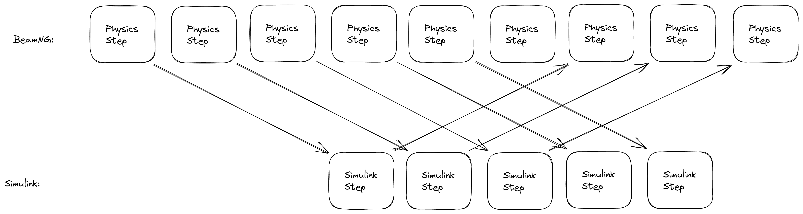
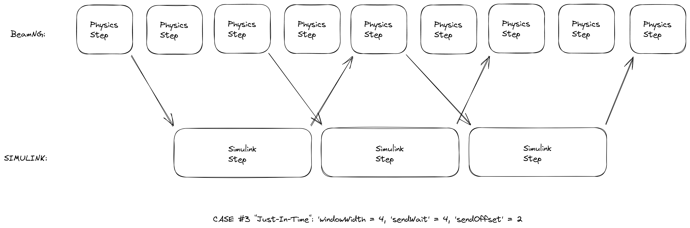

# Setting Up Simulink

In order to set the simulation time in Simulink to match the simulation time in BeamNG, 
the user should use the formula:

```
ceil(simulinkDt / physicsDt) * physicsDt
```

where `simulinkDt` is the Simulink computation time, 
`physicsDt` is the BeamNG physics step time (fixed at 0.0005 seconds), 
and `ceil` is the ceiling operator.
The following figure shows where this is set (highlighted in yellow).


## Coupling case 1



In this case we have the case where the Simulink computation time is similar 
in length to the physics steps in BeamNG. However, the UDP round-trip time is significantly larger.

For efficient coupling, we need to have multiple messages sent out before any are received back in BeamNG. 
Internally, BeamNG will use the two given time measurements to compute the optimal coupling management, 
which will send, receive and block execution at the appropriate times.

## Coupling case 2



This is the opposite case; the Simulink computation time is much slower than the BeamNG physics step time, 
but the UDP round-trip time is quite fast.

Here, it is optimal to have the coupled system skip sending messages on every second physics step. 
If messages were sent at this time, then Simulink would still be processing the previous step and 
would need to buffer them, and this buffering would lead to sync problems in a short amount of time. 
The clear bottleneck here is the Simulink computation time. 
