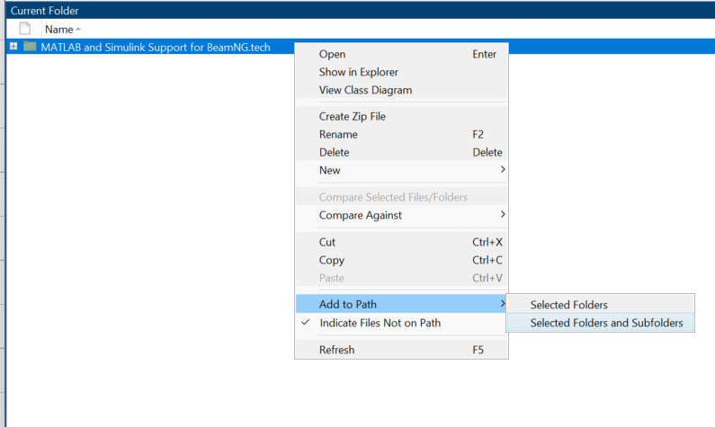

# Troubleshooting

This section lists common issues with this toolbox. Since this
toolbox is closely tied to BeamNG.tech, it is also recommended to consult the [support in documentation website](https://documentation.beamng.com/support/troubleshooter/#bng-adventure:/start/techstart) on BeamNG.tech

If you can not see the toolbox in your Simulink library Browser, you may have to add the toolbox path to MATLAB search path, please do the following steps:

1- open your MATLAB and navigate to your toolbox folder i.e., ```%USERPROFILE%\AppData\Roaming\MathWorks\MATLAB Add-Ons\Toolboxes```

2- from ```current folder``` window, right-click on the toolbox folder, and click on ```Remove from path```, select ```Selected Folders``` as shown below


Figure 8: Remove toolbox folder from path

3-Then, right click on the folder and from ```add path```, select ```Selected Folders and Subfolders``` as shown below

  

Figure 9: Add toolbox folder and Subfolders to path

3-Lastly you have to save this changes in ```MATLAB search path```, look for ```Set Path``` option and click ```Save```

   

Figure 10: Save the changes in ```Set Path```
