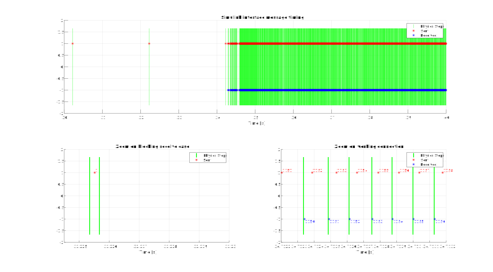
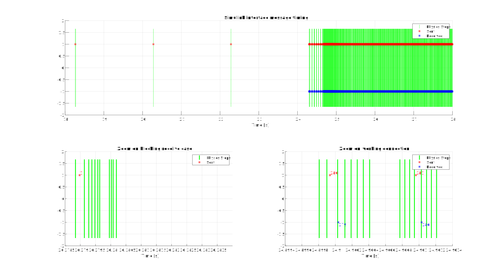
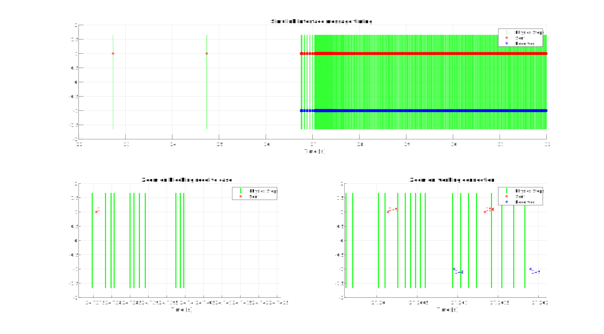
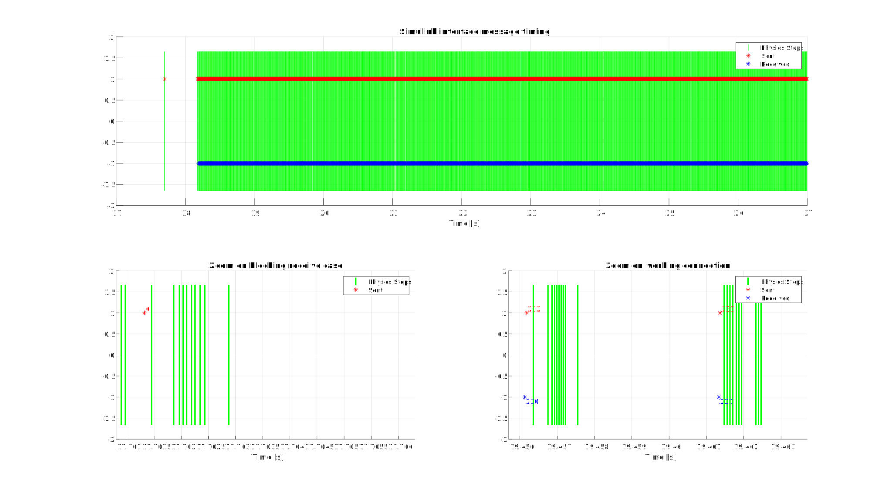
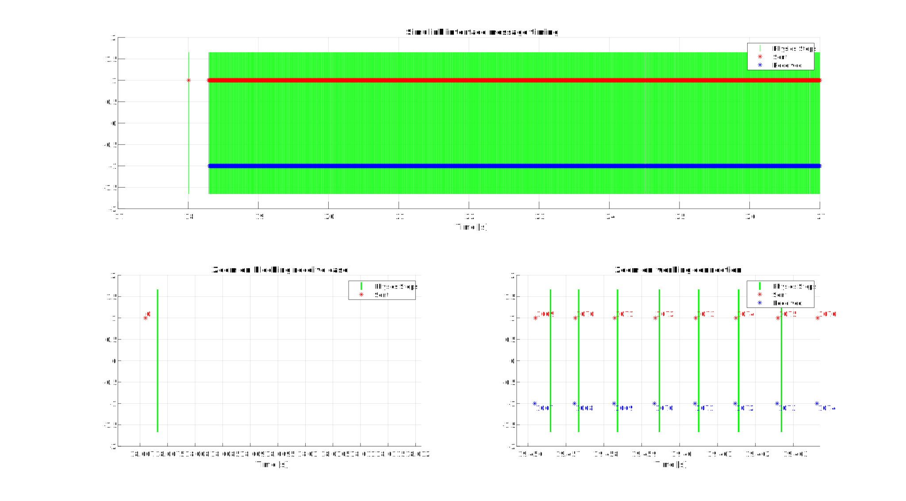

# Simulink Interface Behaviour

- [Simulink Interface Behaviour](#simulink-interface-behaviour)
  - [Introduction](#introduction)
    - [Experiments setup](#experiments-setup)
    - [Cases description](#cases-description)
  - [Tests](#tests)
    - [Case 1](#case-1)
    - [Case 2](#case-2)
    - [Case 3](#case-3)
    - [Case 4](#case-4)
    - [Case 5](#case-5)
  - [Appendix](#appendix)


## Introduction
In this document, different settings of the BeamNG-Simulink Interface are tested to analyse the behaviour of the connection in terms of the timing of the messages sent and received between lua and Simulink.

### Experiments setup
In order to compute these tests a Matlab file has been used. The script loads automatically the lua controller with the parameter `debugFile = true`. This flag makes the controller save three different CSV files:
- `simulinkSendLog.csv`: this file has one row for each message sent from lua with one column for the time at which the message was sent and the other columns containing all the values contained in the message itself. 
- `simulinkReceiveLog.csv`: this file has one row for each message received by lua with one column for the time at which the message was received and the other columns containing all the values contained in the message itself. 
- `simulinkPhysicsStepsLog.csv`: this file has one row for each physics step occured with the lua controller loaded with only one column containing the time at which the physics step began.

After loading the controller, the Matlab script runs a simple Simulink model that uses the BeamNG s-function to receive and store the messages coming from lua in the Matlab workspace and sends messages full of NaNs (exept the message id which is sent with the proper value) back to lua. In addition to this, the model has a Matlab function that takes a number of milliseconds as input and pause the computation for that amount of time. This is needed in order to simulate a bigger computation time of the Simulink model. 

Once the simulation finishes, Matlab creates the plots presented in this document loading the data from the CSV files.
The code of the Matlab file can be found in the [Appendix](#appendix).
  
### Cases description
For each case a table with the following parameters is given to report the values of the testing variables.

| Variable | Meaning |
| --- | --- |
| computatationTime | real computation time of the Simulink model |
| simulinkTime | value of the variable `simulinkTime` in the `vehicleSystemsCoupling.lua` file |
| realPingTime | round trip time obtained with `ping 127.0.0.1` |
| pingTime | value of the variable `pingTime` in the `vehicleSystemsCoupling.lua` file |

Then a Matlab plot of the test will be displayed with three different graphs, one to give a general overview, one to highlight the behaviour when Simulink is not sending yet and the last one to show what happens when the connection is up and running.
Lastly, a brief interpretation of the evidence is given in order to explain what is happening.


## Tests
### Case 1
| Variable | Value |
| --- | --- |
| computatationTime | < 0.5 ms |
| simulinkTime | 0.5 ms |
| realPingTime | < 1 ms |
| pingTime | 0.01 ms |

|  |
|:-:|
| *Figure 1: Case 1 plots* |

Looking at the first plot is clear that before Simulink starts to send back messages, lua waits for two second before sending new messages. 

Zooming around the message sent after 32 seconds it can be noticed that there are only two physics step around the time of that message. In the first physics step lua performs a non-blocking receive collecting nothing and then sends the message. Differently, in the second physics step lua performs a blocking receive that waits for 2 seconds as define in `vehicleSystemsCoupling.lua:line49`. In this case we have that lua blocks already in the first physics step after sending a message because we have zero skips with this configuration. The number of skips is in fact defined as `math.ceil(simulinkTime / physicsDt) - 1` where `physicsDt` is equal to 0.5 ms since this is the default value used in BeamNG.

Zooming where the connection is already espablished and it's running, it can be notice that a message is sent at each physics step (again because there are 0 skips) after receiving a message. Do note that the message received is not the last message sent by lua, but the previous one, this happens because of the memory block in the Simulink model (that is required).

### Case 2
| Variable | Value |
| --- | --- |
| computatationTime | < 0.5 ms |
| simulinkTime | 5 ms |
| realPingTime | < 1 ms |
| pingTime | 0.01 ms |

|  |
|:-:|
| *Figure 2: Case 2 plots* |

In this case the only difference with the [Case 1](#case-1) is that the `simulinkTime` in the lua file has been changed to 5 ms. For this reason now we have 9 skips instead of 0. This can be noticed in both the zoomed plots.

In the bottom left plot can be noticed that before having the physics step that performs the blocking receive we have 9 steps that perfrom a non-bloking receive.

In the bottom right plot we can see that there are 9 steps between 2 consecutive sends. In this case the received message arrives in the step immidiately after the sent one because the Simulink computation time is smaller that the `physicsDt`.

### Case 3
| Variable | Value |
| --- | --- |
| computatationTime | ~1 ms |
| simulinkTime | 5 ms |
| realPingTime | < 1 ms |
| pingTime | 0.01 ms |

|  |
|:-:|
| *Figure 3: Case 3 plots* |

The setup of the lua file in this case is the same of the one in [Case 2](#case-2), but now the computation time of Simulink is bigger (around 1 ms).

The difference becomes clear in the bottom right plot, where in this case the messages are not received in the physics step adjacent to the step where the message has been sent, but in one of the following steps (that perform a non-blocking receive).

### Case 4
| Variable | Value |
| --- | --- |
| computatationTime | ~< 5 ms |
| simulinkTime | 5 ms |
| realPingTime | < 1 ms |
| pingTime | 0.01 ms |

|  |
|:-:|
| *Figure 4: Case 4 plots* |

The setup of the lua file in this case is the same of the one in [Case 2](#case-2) and [Case 3](#case-3), but now the real computation time of is bigger and really close to the value in the variable `simulinkTime`.

Now the message is no longer received in a physics step that perform a non-blocking receive, but in the step of the following send where a blocking receive is performed. In this case lua is slowed down by Simulink, but is still working properly in real-time (if the computation time of Simulink does not exceed the `simulinkTime` variable). This happen because in normal condition lua computes the physics steps ahead of time.

### Case 5
| Variable | Value |
| --- | --- |
| computatationTime | ~1 ms |
| simulinkTime | 0.5 ms |
| realPingTime | < 1 ms |
| pingTime | 0.01 ms |

**Attention: this configuration alter the simulation speed of BeamNG**

|  |
|:-:|
| *Figure 5: Case 5 plots* |

This example shows what happen when the computation time of Simulink is greater than the value of `simulinkTime`. Like in [Case 1](#case-1) we have the setup with 0 skips, but now the computation time of Simulink is ~1ms.

In the bottom right plot it's clear that lua sends and receives messages at each physics step where it performs a blocking receive. However, due to the higher computation time of Simulink, now lua is slowed down. Differently from [Case 4](#case-4) now the slowing amount is bigger and therefore the simulation on BeamNG will be slower than real-time.

For this reason if real-time simulation is a strict requirement for a specific implementation the computation time of simulink shall be lower than `simulinkTime`.

## Appendix
The following Matlab code is the script used to run all the tests described in this document. Do note that the sequence `<value>` is used to indicate values that are changed for each test to modify the limits of the x-axis in the plots.
```matlab
close all
clear
clc

% Start the simulator.
beamng = py.beamngpy.BeamNGpy('localhost', int32(64256));

beamng.open();

% Create a vehicle.
vehicle = py.beamngpy.Vehicle('etk800', ...
    pyargs('model', 'etkc', 'licence', 'BeamNG', 'color', 'Black'));

% Create a scenario.
scenario = py.beamngpy.Scenario('smallgrid', 'simulink', ...
    pyargs('description', 'Message Consitency Test'));

scenario.add_vehicle(vehicle)
scenario.make(beamng)
beamng.load_scenario(scenario)
beamng.start_scenario()

pause(2)

vehicle.queue_lua_command("controller.loadControllerExternal" + ...
                          "('tech/vehicleSystemsCoupling', " + ...
                          "'vehicleSystemsCoupling', {debugFile=true})")

set_param('messageConsistencyTestModel', 'SimulationCommand', 'start')

pause(10)

beamng.restart_scenario();
beamng.close()

pause(4)

simulinkData = out.simulinkData.Data;

path2csv = strcat(getenv('USERPROFILE'), '\AppData\Local\BeamNG.drive\0.30\simulinkSendLog.csv');
luaSendData = readmatrix(path2csv);
luaSendData = luaSendData(2:end, :);

path2csv = strcat(getenv('USERPROFILE'), '\AppData\Local\BeamNG.drive\0.30\simulinkReceiveLog.csv');
luaReceiveData = readmatrix(path2csv);
luaReceiveData = luaReceiveData(2:end, :);

path2csv = strcat(getenv('USERPROFILE'), '\AppData\Local\BeamNG.drive\0.30\simulinkPhysicsStepsLog.csv');
luaPhysicsStepsData = readmatrix(path2csv);
luaPhysicsStepsData = luaPhysicsStepsData(2:end, :);

%% Plots

startTime = <value>;
endTime = <value>;
dt = 0.0005;

sendWithBlock = <value>;
zoom1 = [sendWithBlock-dt sendWithBlock+dt*<value>];

middlePoint = <value>;
zoom2 = [middlePoint-dt middlePoint+dt*<value>];

figure

% Total Plot
subplot(2, 2, 1:2)
grid on
hold on

plot(luaPhysicsStepsData(:, 1), zeros(size(luaPhysicsStepsData(:, 1))), 'g|', 'MarkerSize', 200)
plot(luaSendData(:, 1), ones(size(luaSendData(:, 1))), 'r*')
plot(luaReceiveData(:, 1), - ones(size(luaReceiveData(:, 1))), 'b*')

xlim([startTime endTime])
ylim([-2 2])
legend('Physics Steps', 'Sent', 'Received')
title('Simulink interface message timing')
xlabel('Time [s]')

% Zoom on blocking
subplot(2, 2, 3)
grid on
hold on

physicsStepsElements = luaPhysicsStepsData(:, 1) > zoom1(1) & luaPhysicsStepsData(:, 1) < zoom1(2);
sendElements = luaSendData(:, 1) > zoom1(1) & luaSendData(:, 1) < zoom1(2);
receiveElements = luaReceiveData(:, 1) > zoom1(1) & luaReceiveData(:, 1) < zoom1(2);

plot(luaPhysicsStepsData(physicsStepsElements, 1), zeros(size(luaPhysicsStepsData(physicsStepsElements, 1))), 'g|', 'MarkerSize', 200, 'LineWidth', 2)
plot(luaSendData(sendElements, 1), ones(size(luaSendData(sendElements, 1))), 'r*')
text(luaSendData(sendElements, 1), 1.1 * ones(size(luaSendData(sendElements, 1))), num2str(luaSendData(sendElements, 2)), 'Color', 'red')
plot(luaReceiveData(receiveElements, 1), - ones(size(luaReceiveData(receiveElements, 1))), 'b*')
text(luaReceiveData(receiveElements, 1), - 1.1 * ones(size(luaReceiveData(receiveElements, 1))), num2str(luaReceiveData(receiveElements, 2)), 'Color', 'blue')

xlim(zoom1)
ylim([-2 2])
legend('Physics Steps', 'Sent')
title('Zoom on blocking receive case')
xlabel('Time [s]')

% Zoom on startup
subplot(2, 2, 4)
grid on
hold on

physicsStepsElements = luaPhysicsStepsData(:, 1) > zoom2(1) & luaPhysicsStepsData(:, 1) < zoom2(2);
sendElements = luaSendData(:, 1) > zoom2(1) & luaSendData(:, 1) < zoom2(2);
receiveElements = luaReceiveData(:, 1) > zoom2(1) & luaReceiveData(:, 1) < zoom2(2);

plot(luaPhysicsStepsData(physicsStepsElements, 1), zeros(size(luaPhysicsStepsData(physicsStepsElements, 1))), 'g|', 'MarkerSize', 200, 'LineWidth', 2)
plot(luaSendData(sendElements, 1), ones(size(luaSendData(sendElements, 1))), 'r*')
text(luaSendData(sendElements, 1), 1.1 * ones(size(luaSendData(sendElements, 1))), num2str(luaSendData(sendElements, 2)), 'Color', 'red')
plot(luaReceiveData(receiveElements, 1), - ones(size(luaReceiveData(receiveElements, 1))), 'b*')
text(luaReceiveData(receiveElements, 1), - 1.1 * ones(size(luaReceiveData(receiveElements, 1))), num2str(luaReceiveData(receiveElements, 2)), 'Color', 'blue')

xlim(zoom2)
ylim([-2 2])
legend('Physics Steps', 'Sent', 'Received')
title('Zoom on working connection')
xlabel('Time [s]')
```